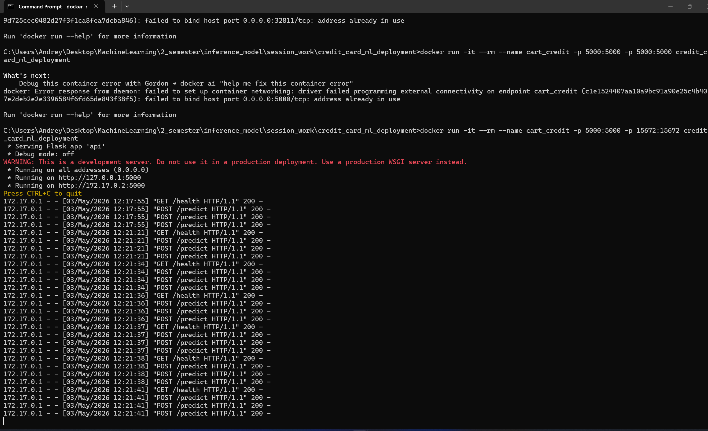
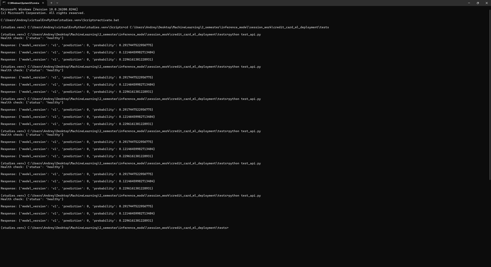

# Оценка кредитного риска (Credit Card Default Prediction)

Микросервис для прогнозирования вероятности дефолта по кредитной карте на основе логистической регрессии. Модель обучена на датасете UCI Credit Card Dataset. Сервис предоставляет REST API для получения предсказаний в реальном времени.

# Быстрый старт (Docker Hub)

Проще всего запустить сервис с помощью Docker. Образ опубликован и готов к использованию.

bash
docker pull andreygan/credit_card_ml_deployment:latest
docker run -d -p 5000:5000 --name credit-card-api andreygan/credit_card_ml_deployment

После запуска сервис будет доступен по адресу: http://localhost:5000

git clone https://github.com/andreygan/credit_card_ml_deployment.git
cd credit_card_ml_deployment

# Установите зависимости (рекомендуется использовать виртуальное окружение):

bash
pip install -r requirements.txt

# Запустите Flask-приложение:

bash
python app/app.py

# API эндпоинты

Проверка здоровья сервиса
GET /health

Пример ответа:

json
{
  "status": "healthy"
}

POST /predict

Тело запроса должно содержать JSON с 23 признаками (порядок не важен, ключи сортируются автоматически):

json
{
  "LIMIT_BAL": 50000,
  "SEX": 1,
  "EDUCATION": 2,
  "MARRIAGE": 1,
  "AGE": 30,
  "PAY_0": 0,
  "PAY_2": 0,
  "PAY_3": 0,
  "PAY_4": 0,
  "PAY_5": 0,
  "PAY_6": 0,
  "BILL_AMT1": 10000,
  "BILL_AMT2": 9000,
  "BILL_AMT3": 8000,
  "BILL_AMT4": 7000,
  "BILL_AMT5": 6000,
  "BILL_AMT6": 5000,
  "PAY_AMT1": 1000,
  "PAY_AMT2": 1000,
  "PAY_AMT3": 1000,
  "PAY_AMT4": 1000,
  "PAY_AMT5": 1000,
  "PAY_AMT6": 1000
}

# Пример ответа:

json
{
  "prediction": 0,
  "probability": 0.23,
  "model_version": "v1"
}
prediction: 0 - клиент не дефолтный, 1 - дефолтный.

probability: вероятность дефолта (от 0 до 1).

model_version: версия модели.

# Примеры работы api(скриншоты)

Реальные запросы и ответы API представлены на скриншотах:

# Структура проекта

credit_card_ml_deployment/
├── app/
|   |
│   └── app.py              # Flask-приложение (API)
|
├── models/
|   |
│   ├── modelv1.pkl         # Сериализованная модель
|   |
│   └── data/
|       |
│       └── UCI_Credit_Card.csv  # Датасет для обучения
|
├── tests/
|   |
│   └── test_api.py         # Скрипт для тестирования API
|
└── requirements.txt        # Зависимости Python

# Тестирование

После запуска сервиса выполните:

bash
python tests/test_api.py

Вы должны увидеть:

Health check: {'status': 'healthy'}
Response: {'prediction': 0, 'probability': 0.xx, 'model_version': 'v1'}

# Сборка Docker образа (для самостоятельной сборки)

bash
docker build -t credit_card_ml_deployment .
docker run -d -p 5000:5000 --name credit-card-api credit_card_ml_deployment

# Оптимизация модели: конвертация в ONNX-ML

ONNX (Open Neural Network Exchange) - это открытый формат для представления моделей машинного обучения. Он позволяет:

Ускорить инференс (предсказания) за счёт оптимизированных рантаймов (ONNX Runtime)

Запускать модель на разных платформах (Windows, Linux, мобильные устройства)

Снизить потребление памяти при загрузке модели

# Почему ONNX-ML, а не просто ONNX?

Стандартный ONNX ориентирован на нейронные сети. ONNX-ML - это расширение, которое добавляет поддержку классических алгоритмов машинного обучения: деревья решений, случайные леса, логистическая регрессия, линейные модели и т.д. 

# Production-архитектура: uWSGI + NGINX

В продакшен-среде Flask-приложение никогда не запускают через встроенный сервер app.run() - он однопоточный, медленный и небезопасный. Для реальной нагрузки используют связку uWSGI (или Gunicorn) + NGINX.

Даже если ваша кредитная модель сейчас используется 10 раз в день, она может вырасти до 1000+ запросов в секунду. Связка NGINX + uWSGI:

Позволит горизонтально масштабироваться (запустить несколько воркеров на разных ядрах)

Защитит от медленных клиентов (NGINX буферизирует запросы)

Отдаст статику (HTML, CSS, JS) без нагрузки на Python

Обеспечит безопасность (терминирование HTTPS, ограничение по IP)

# Обзор инструментов MLops

DVC (Data Version Control) - контроль версий данных и моделей
DVC (Data Version Control) - это инструмент для версионирования больших файлов (датасетов, моделей) вместе с кодом. Он работает поверх Git, но вместо хранения самих данных хранит ссылки на них.

Нельзя хранить в Git (репозиторий раздуется, GitHub не разрешает файлы >100 МБ)

Нужно версионировать - чтобы при откате кода модели откатились и данные

Решение: DVC хранит данные в облаке (S3, GCS, S3 и т.д.), а в Git - только метаданные.

DVC решает проблему «больших файлов» в Git. Для нашего проекта это критично, потому что датасет и модель нельзя хранить прямо в репозитории. DVC автоматически синхронизирует данные с облачным хранилищем, а в Git сохраняет только метаданные. При переключении между Git-ветками dvc checkout подтягивает соответствующие версии датасета и модели, обеспечивая полную воспроизводимость экспериментов.

MLflow - это платформа для управления жизненным циклом ML-моделей: от экспериментов до деплоя.

MLflow решает проблему «воспроизводимости и сравнения экспериментов». В нашем проекте, где модель будет дорабатываться (новые алгоритмы, гиперпараметры, отбор признаков), MLflow позволяет автоматически логировать параметры, метрики и артефакты каждого запуска. Встроенный Model Registry даёт возможность утвердить лучшую версию модели, перевести её в staging/production и отследить, какая версия сейчас на production. Это критически важно для командной разработки и для внедрения CI/CD в ML-пайплайн.

# Бизнес-метрики

1. Стоимость ложного отказа

Суть: сколько прибыли теряет банк, когда отказывает хорошему клиенту (ложноположительное срабатывание модели на «нормального» заёмщика).

Банк зарабатывает на процентах по кредитам. Если модель ошибочно отказывает 100 надёжным людям, банк теряет потенциальные деньги, которые они принесли бы за время пользования кредитом.

Пример:
Модель ошибочно отклонила 100 хороших клиентов. Средний кредит 50 000 руб., ставка 25% годовых, срок 1 год.
Потерянная прибыль = 100 × 50 000 × 0.25 = 1 250 000 руб.

Как использовать:

Сравниваем две модели, у какой стоимость ложных отказов меньше, та и лучше для бизнеса (при условии, что уровень дефолтов не вырос).

2. Ожидаемая экономия от снижения дефолтов

Суть: сколько денег банк сэкономит, если модель правильно предскажет дефолты и позволит отказать «плохим» клиентам.

Заказчику не нужна абстрактная «точность». Ему нужно знать: «Если мы заменим старую модель скорринга на новую - сколько миллионов рублей мы сэкономим в год?»

Пример:
Старая модель -> ожидаемый убыток 500 000 руб.
Новая модель -> ожидаемый убыток 350 000 руб.
Экономия: 150 000 руб. на тестовой выборке.

Если масштабировать на весь портфель (допустим, 100 000 кредитов в год), экономия может составить миллионы рублей.

Почему эта метрика важна бизнесу:
Она показывает не «качество модели», а реальный финансовый эффект внедрения. Если модель хуже старой - экономия отрицательная, и заказчик не захочет её ставить.

# Концепция A/B-теста для сравнения моделей v1 и v2

Цель теста

Сравнить финансовую эффективность двух моделей кредитного скоринга:

Контроль (A): текущая модель v1 (логистическая регрессия)

Тест (B): новая модель v2 (например, градиентный бустинг или Random Forest)

Бизнес-гипотеза:
Внедрение модели v2 позволит снизить ожидаемые потери от дефолтов на X% без существенного снижения доли одобренных заявок (или наоборот - увеличить долю одобрений без роста уровня дефолтов).

Для обеспечения статистической валидности используется рандомизация на уровне пользователя:

Unit рандомизации	ID заявки / ID пользователя
Распределение	50% - контроль (v1), 50% - тест (v2)

Критически важно:

Группа фиксируется для клиента на весь период теста (повторяя визит, клиент всегда попадает в ту же группу)

Это исключает пересечение эффектов и упрощает анализ

Стратификация не требуется, так как ожидается, что 50/50 распределение обеспечит близкий состав групп по ключевым признакам без дополнительных мер.

Продолжительность теста
Расчёт длительности опирается на:

Базовую конверсию в дефолт (≈22% в датасете)

Минимально детектируемый эффект - ожидаемое снижение дефолтов на 5% относительно (от 22% до ~20.9%)

Статистическая мощность 80%, уровень значимости 5%

Формула требуемого размера выборки

n = (Zalpha/2 + Zbeta)^2 × (p1(1-p1) + p2(1-p2)) / (p2-p1)²

Результат: ~21 000 заявок в каждой группе → общая выборка ~42 000 заявок.

Ежедневный трафик и длительность
Средний дневной поток заявок (опросы, тестирование, реальные обращения) например, 500 заявок в день. При 50/50 сплите каждая группа получает по 250 заявок в день.

Длительность = 21 000 / 250 = 84 дня

Округляем до 90 дней (3 месяца)  более реалистично, позволяет накопить достаточную статистику, особенно если эффект модели не очень сильный.

Если ожидается более сильный эффект (например, -10% дефолтов), выборка может быть меньше, а тест закончится быстрее.

На практике часто совмещают A/B тест с пилотным внедрением: сначала 2–4 недели смотреть на технические метрики (работа API, скорость ответа), потом на бизнес-метрики

# Метрики для оценки

Первичная (бизнес)	Ожидаемые потери от дефолтов	базовые	ниже 5–10%
Вторичная (бизнес)	% одобренных заявок	базовый	не ниже	≥0%
Сторожевая	Время ответа модели	< 100 мс	< 100 мс	
Сторожевая	средняя вероятность дефолта		не выше	

Первичная метрика главный критерий успеха статистически значимого улучшения (t-test или z-test для пропорций)

Вторичная метрика нужна, чтобы убедиться, что мы не «чиним» дефолты за счёт полного отказа всем

Сторожевые метрики контролируют техническое здоровье эксперимента

# Этапы проведения теста

Подготовка	1 неделя	Настроить автоматическое распределение, логирование, дашборд
Предтест (AA-тест)	1–2 недели	Убедиться, что группы действительно одинаковы (пропустить весь трафик через модель v1, распределение 50/50 метрики должны совпадать)
Основной тест	90 дней	Запущены модели v1 и v2
Анализ	3–5 дней	Фиксируем итоговые метрики, проверяем статистическую значимость